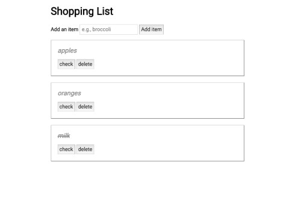

Shopping List App
=================

 

Motivation:  
------------
This is a useful application that can be used on the go to quickly create lists saving on the endless piles of paper lists sitting around a kitchen or office.  This app was created with the Javascript library, jQuery, and minimal CSS.  This interactive web app is a grocery list in which the user can add items, delete items or cross items off.  Key concepts:  event listeners, DOM traversal and manipulation, a11y considerations.  

A Live Link:
-------------------------------------
<a href="https://tmassela.github.io/Shopping-List-App/">Shopping List App Live</a>

Key Technologies:  
----------------
-jQuery
-Javascript
-HTML
-CSS 

Author:
----------------
Tiffany Massela

Special Acknowledgments:
------------------------
Her wonderful family of picky eaters.
